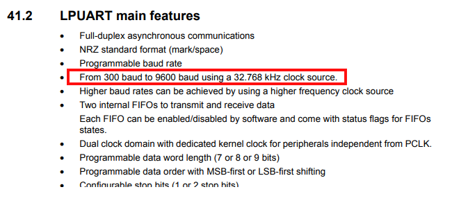
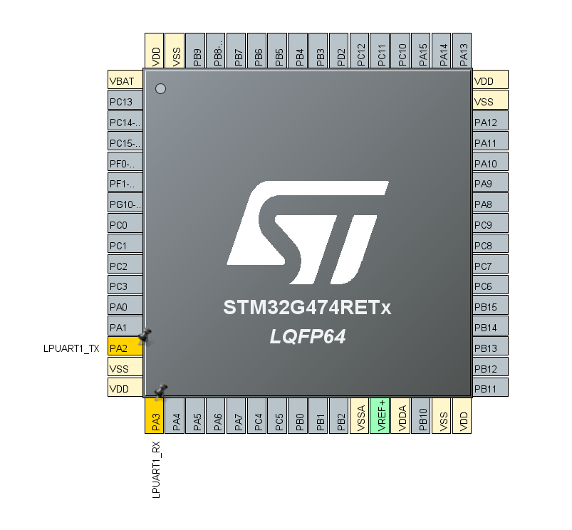
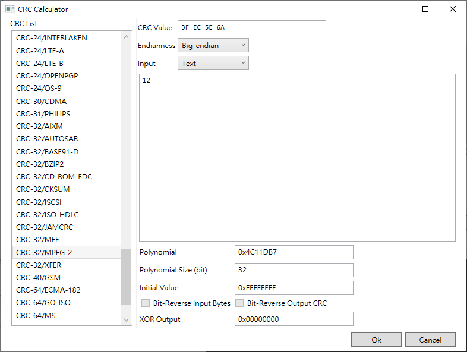

## Tutorial
* Per the board's user manual, we can communicate with LPUART1 using a USB VCOM connection (PA2/PA3).


* According to the reference manual, the maximum baud rate is 9600.  


* Configure the .ioc file  



* Setup printf to use LPUART1  
    ``` C
    /* USER CODE BEGIN 0 */
    int __io_putchar(int ch)
    {
        HAL_UART_Transmit(&hlpuart1, (const uint8_t *)&ch, 1, HAL_MAX_DELAY);
        return ch;
    }
    /* USER CODE END 0 */
    ```

* Print a test message. Be careful to only add code within the user code regions, as any code outside these regions will be overwritten when the .ioc regenerates code.  
    ``` C
    /* USER CODE BEGIN WHILE */
    while (1)
    {
        HAL_Delay(1000);
        printf("Hello World!\r\n");
        /* USER CODE END WHILE */

        /* USER CODE BEGIN 3 */
    }
    /* USER CODE END 3 */
    ```
* Use HAL_CRC_Calculate API
    ``` C
    uint8_t buffer[] = {'1', '2'};
    while (1)
    {
        HAL_Delay(1000);
        uint32_t crc = HAL_CRC_Calculate(&hcrc, buffer, sizeof(buffer));
        printf("CRC = %X\r\n", crc);
    /* USER CODE END WHILE */

    /* USER CODE BEGIN 3 */
    }
    ```

* Check the CRC computed by MCU is correct  

