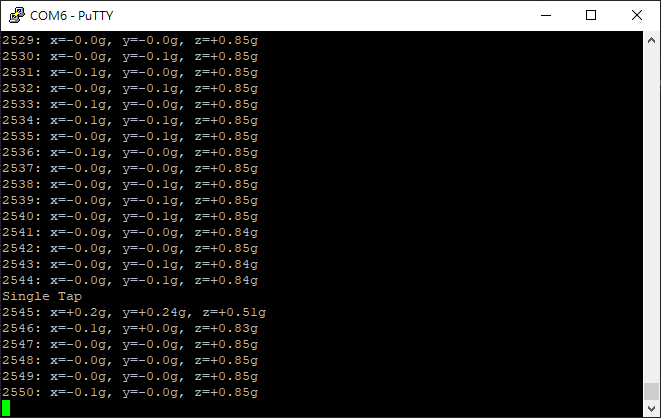
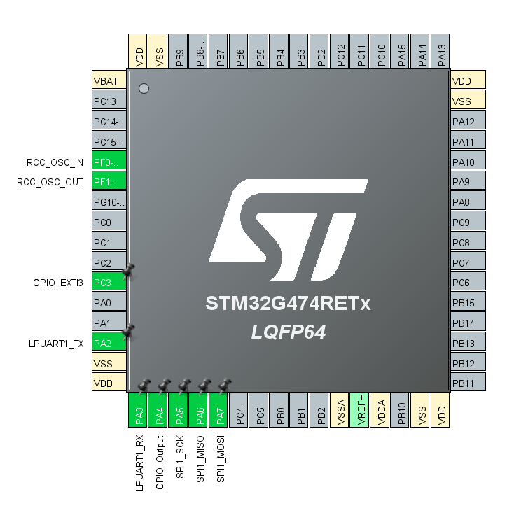
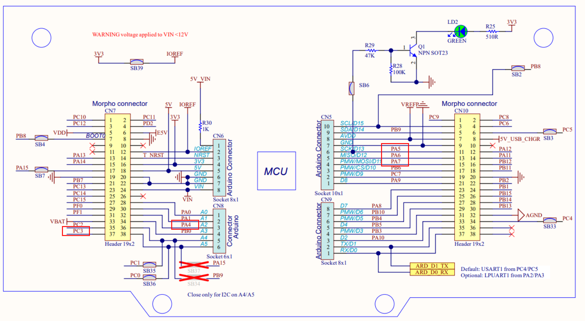

# ADXL345  
A simple example of interfacing with external device - accerometer ADXL345.  
* [Datasheet](https://www.analog.com/media/en/technical-documentation/data-sheets/adxl345.pdf)
* [Breakout Board](https://www.sparkfun.com/sparkfun-triple-axis-accelerometer-breakout-adxl345.html)
* OS: FreeRTOS
* Interface: SPI (4-wire)

## Implemented Feature  
* Print out Acceleration data (X, Y, Z)
* Single Tap event  

## Pinout  
| STM32G474 Pin | Function | Dev Board | ADXL345 Pin|
|--|--|--|--|
PA4 | GPIO_Output | CN7-32 | CS
PA5 | SPI1_SCK | CN5-6 | SCLK
PA6 | SPI1_MISO | CN5-5 | SDO
PA7 | SPI1_MOSI | CN5-4 | SDA
PC3 | GPIO_EXTI3 | CN7-32 | INT1
N/A  | N/A | CN6-4 | VCC
N/A | N/A | CN5-7 | GND
PA2 | LPUART1_TX | N/A | N/A
PA3 | LPUART1_RX | N/A | N/A

