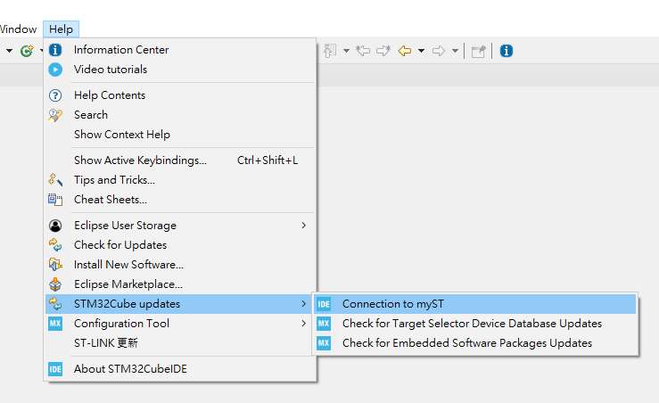

# stm32g4-lab

This project serves as a simple and practical tutorial for those interested in getting started with STM32 firmware development.

## Projects
* [CRC](01-CRC/readme.md)
* [ADXL345](02-ADXL345/readme.md)

## Development Hardware and Software

- **Development Board:**  
  `NUCLEO-G474RE`
- **USB cable**  
  Type A (male) to Micro B (male)

- **IDE:**  
  `STM32CubeIDE 1.19.0`

## IDE  

- You must create a ST account to download the IDE.
- **Important:** After installation, you need to log in to use the IDE.  
  - In version 1.19.0, this is located at:  
    `Help` => `STM32Cube updates` => `Connection to myST`
  - Note: The login location may vary between versions, so you may need to locate it manually.  
    

## Official Documentation

STM32 provides a wide range of official documents for different purposes. In my opinion, the following are the most essential:

### **MCU – `STM32G474RE`**

- **Datasheet**
  - Basic introduction to the MCU
  - Block diagram
  - Pin descriptions: Each pin supports only a limited set of functionalities; check this section for mapping.
  - Order information: Understand designations like `"RE"`.

- **Reference Manual**
  - Comprehensive technical details
  - System architecture and memory map
  - In-depth explanation of each peripheral:
    - Functionality of each register — this is essential reading beyond just using the provided APIs.
    - Register addresses

### **Development Board – `NUCLEO-G474RE`**

- **User Manual**
  - Powering the board (multiple configurations supported)
  - The pin of USER Button and USER LED
  - The UART mapped to the virtual COM port
  - Description of onboard LED indicators

- **Schematic**
  - Full PCB wiring details
  - Understand why certain pins cannot be used for specific peripheral
